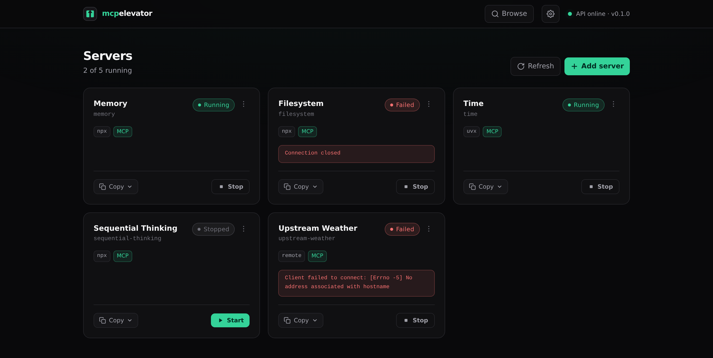
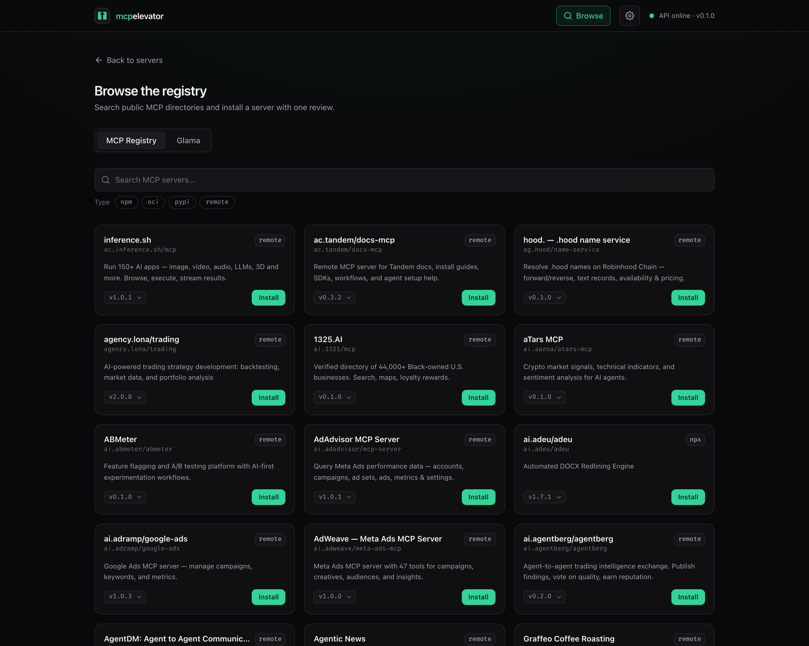
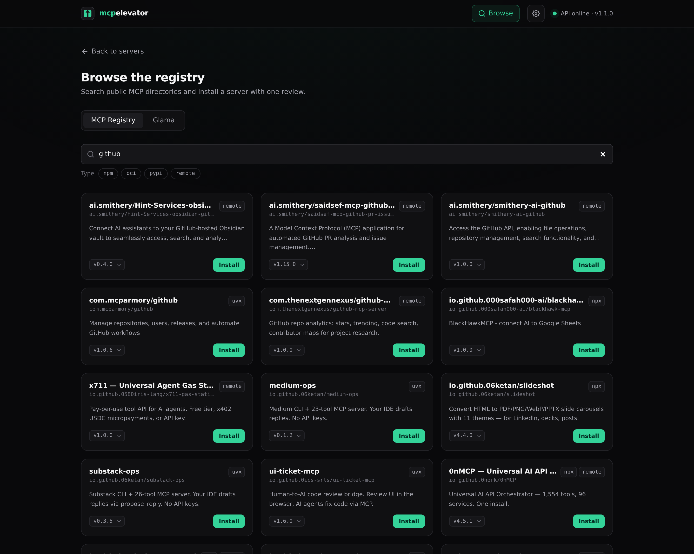
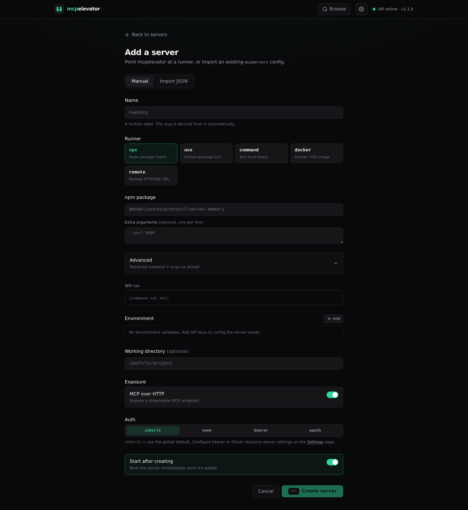
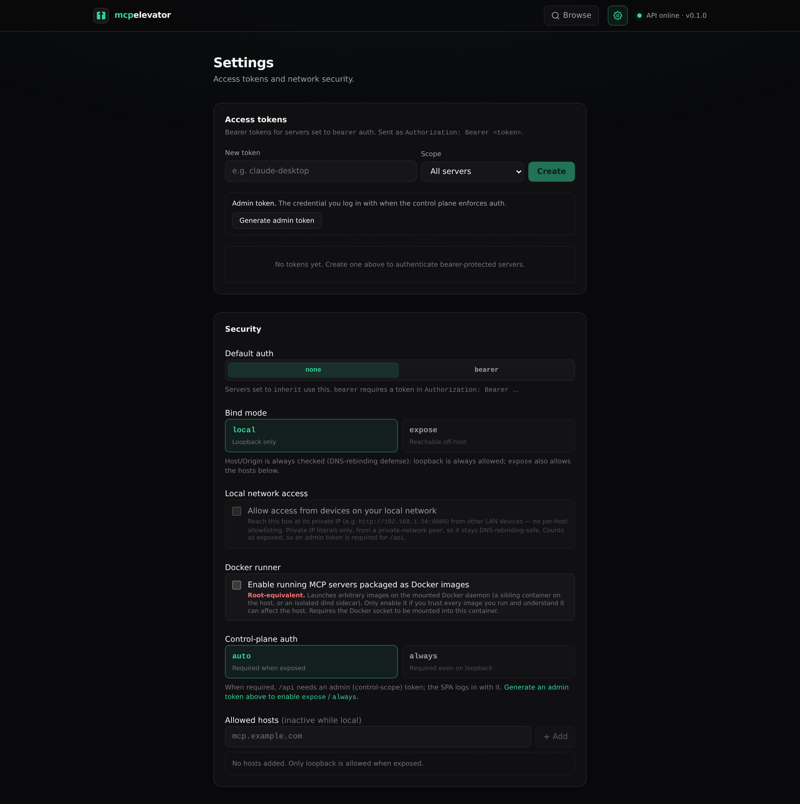
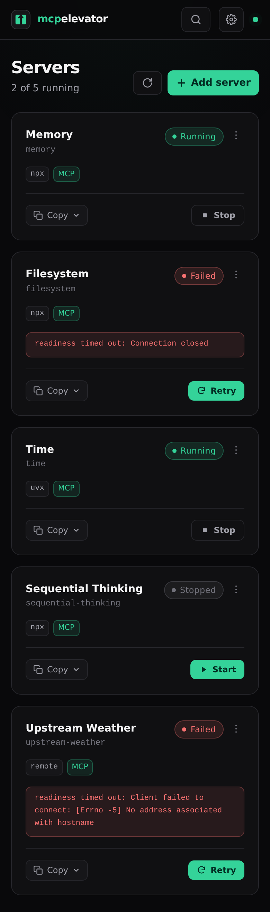

# mcpelevator

**Elevate MCP servers into authenticated HTTP endpoints. Self-hosted, in one container.**

Most [MCP](https://modelcontextprotocol.io) servers ship as **stdio** programs (`npx -y …`, `uvx …`, a command, a docker image). Stdio only works when the client can spawn the process locally, which **phones and most "any device" setups can't do**. mcpelevator runs those servers for you and exposes each one as a remote **Streamable HTTP** endpoint (the transport Claude mobile, Flutter clients, etc. connect to). Add a server, press start, copy the URL into your client. Each server can also opt into a plain **REST/OpenAPI** surface (`/s/<slug>/rest/<tool>`), so curl, automation, and GPT Actions can call its tools without speaking MCP.

Already-remote servers work too: point mcpelevator at an existing Streamable-HTTP/SSE MCP URL (the `remote` runner) and it proxies that upstream behind the same auth, supervision, and per-client copy menu as a local one — handy for putting bearer auth in front of a remote server, or giving every client one consistent endpoint.

The protocol bridging is done by [FastMCP](https://gofastmcp.com); mcpelevator is the **control plane**: a clean UI, process supervision, security, and onboarding around it.

## How it works

```
[Claude mobile / any MCP client] ──Streamable HTTP──┐
                                                    ▼
  FastAPI ─ /            SvelteKit SPA              (one container, one port)
          ─ /api/*       control plane (SSOT in SQLite)
          ─ /s/<slug>/mcp   one server   ─┐  auth + Host/Origin enforced here
          ─ /g/<name>/mcp   a group       │  (a registry-declared bundle of servers)
                                           ▼
  per enabled server: 1 supervised bridge process (own uvicorn on a loopback port)
      FastMCP proxy(stdio command — or a remote HTTP/SSE URL) → Streamable HTTP   ← fault-isolated, real PID/logs
```

A reconciler converges running processes to the desired state in SQLite (Kubernetes-style), so the system is idempotent and survives restarts.

## Screenshots

Add a server, press start, copy the URL. The dashboard supervises each one — live state, per-server errors, and a copy menu for the endpoint.



<table>
  <tr>
    <td width="50%"><br><b>Browse the registry</b> — search public MCP directories.</td>
    <td width="50%"><br><b>Search &amp; install</b> — pick a version, install with one review.</td>
  </tr>
  <tr>
    <td><br><b>Add a server</b> — npx, uvx, a command, or a remote URL.</td>
    <td><br><b>Settings</b> — access tokens, bind mode, and the LAN gate.</td>
  </tr>
</table>

<details>
<summary>Mobile</summary>



</details>

## Quickstart (Docker)

```bash
docker compose up --build
# open http://127.0.0.1:8080
```

The image is batteries-included (Node/npx + Python/uv preinstalled, plus a native build toolchain — `build-essential`, `cmake`, `pkg-config`, Go, Rust — for servers that compile native extensions on install), so `npx`/`uvx` servers run with no extra setup. Need a tool beyond that (or a newer toolchain than Debian ships)? Set `MCPE_APT_PACKAGES` to install extra Debian packages at container startup (see **Configuration**), or derive your own image (`FROM ghcr.io/pacnpal/mcpelevator`). Data (SQLite + package caches) persists in the `mcpe-data` volume. By default the port is published to host loopback only. See **Security**.

## Quickstart (Unraid)

A Community Applications template lives in
[pacnpal/unraid-templates](https://github.com/pacnpal/unraid-templates)
(`mcpelevator.xml`). It ships the recommended self-hosted-box setup out of the box:
**host networking** (so the LAN gate sees real client IPs), appdata persisted to
`/mnt/user/appdata/mcpelevator`, and `MCPE_ALLOW_PRIVATE_LAN=true` so the headless box
is reachable from your LAN on first boot — the admin token is printed once to the
container log for you to log in with. Full walkthrough (install, first login, updating,
troubleshooting): [docs/unraid.md](docs/unraid.md).

## Quickstart (local dev)

```bash
# backend (control plane) on http://127.0.0.1:8080
cd backend && uv sync && uv run uvicorn app.main:app --reload

# frontend (HMR) on http://localhost:5173, proxies /api and /s to :8080
cd frontend && npm install && npm run dev
```

Or use the `Makefile`: `make dev-backend`, `make dev-frontend`, `make build`, `make test`, `make docker`.

## Adding a server

Via the API (the UI add-flow wraps this):

```bash
curl -X POST http://127.0.0.1:8080/api/servers -H 'content-type: application/json' -d '{
  "name": "Memory", "runner": "npx", "command": "npx",
  "args": ["-y", "@modelcontextprotocol/server-memory"],
  "setup_script": "command -v node >/dev/null", "enabled": true
}'
```

Then point any MCP client at `http://127.0.0.1:8080/s/memory/mcp`.

### Per-server setup and startup retries

`setup_script` is optional and supported only by the `npx`, `uvx`, and `command`
local runners. Before every startup attempt, mcpelevator runs it with
`/bin/sh -e -c` as the mcpelevator process user, using the local MCP child's initial
effective environment and working directory. Files and other external effects persist
according to where the script writes them. Shell-local changes such as `export`, `cd`,
and aliases end with the setup shell and do not carry into the MCP child. Scripts must
be safe to run again. Docker setup belongs in the image, and a `remote` server has no
local setup process.

The script is stored as plain server configuration, and its combined stdout/stderr goes
to the authenticated server logs. Treat both the script and its output as sensitive.
The official container currently runs as root, so setup scripts in that container do
too. Across a container replacement, only mounted or otherwise persistent paths and
package caches configured on those paths survive. `MCPE_APT_PACKAGES` is different: it
is global container bootstrap for extra Debian packages before mcpelevator starts, not
per-server setup.

Each startup attempt runs setup, launches the bridge, and checks readiness. Setup and
readiness each get a separate `MCPE_START_TIMEOUT_S` window. Failed setup, bridge launch
or readiness, and exits before a stable run retry the full attempt, including setup.
`MCPE_RESTART_BUDGET` defaults to 5 attempts, with waits of 2, 4, 8, then 16 seconds;
further waits stay at 16 seconds. After `MCPE_RESTART_STABLE_S` (60 seconds by default)
of uninterrupted running, the retry budget is restored. Stop cancels startup and any
pending retry.

An enabled server in `failed` or `unhealthy` state can be retried in the UI without
changing its saved configuration, or through the API:

```bash
curl -X POST "http://127.0.0.1:8080/api/servers/<server-id>/retry"
```

### Idle shutdown (wake-on-request)

Every enabled server normally keeps a resident bridge process. On a box with many
registered servers, turn on **idle shutdown**: after a configurable window with no
traffic, the supervisor stops the bridge (state **idle**) and the proxy transparently
restarts it on the next request — the request is held until the server is ready
(bounded by `MCPE_START_TIMEOUT_S`), so clients just see a slower first call, not an
error. Memory then scales with what's *in use*, not with what's registered.

Set the global default in **Settings → Idle shutdown** (`idle_timeout_s`, seconds;
`0` = off, the default — existing installs keep today's always-running behavior),
and override it per server in the server form (blank = inherit, `0` = pin the server
always-on). Idle servers report a passing `/api/health/{slug}` status (`"idle"`) so
load balancers don't eject a deliberately-sleeping endpoint. Group (`/g`) traffic
counts as activity for the group's members, but doesn't wake already-idle ones.

### Try a tool from the dashboard (playground)

A running server's detail page lists its discovered tools — each with a **Try it**
panel that builds an argument form from the tool's JSON input schema (with a raw-JSON
fallback for complex shapes) and invokes the tool through the control plane. No MCP
client or data-plane token needed: it's the fastest way to verify a server actually
works — not just that it started — before pointing a real client at it.

### Per-server REST/OpenAPI surface

Turn on **REST / OpenAPI** in a server's Exposure section and the same supervised
bridge additionally serves each tool as plain REST behind the identical auth/proxy
path:

```bash
curl -X POST http://127.0.0.1:8080/s/memory/rest/create_entities \
  -H 'content-type: application/json' -d '{"entities": [...]}'
```

- `POST /s/<slug>/rest/<tool>` — body is the tool's JSON arguments; the response is a
  stable envelope `{is_error, content, structured_content}` mirroring MCP semantics
  (a tool's own failure is `is_error: true` in a 200; unknown tool → 404).
- `GET /s/<slug>/rest/openapi.json` — an OpenAPI 3.1 document generated from the live
  tool list (request schemas included), ready to feed to GPT Actions or any OpenAPI
  tooling. `GET /s/<slug>/rest` lists the tools.

**Already remote?** Use the `remote` runner to proxy an existing Streamable-HTTP/SSE MCP URL — no local process. The launch spec reuses the same fields: `command` is the upstream URL, `args[0]` is the transport (`streamable-http` or `sse`), and `env` is the upstream HTTP headers.

```bash
curl -X POST http://127.0.0.1:8080/api/servers -H 'content-type: application/json' -d '{
  "name": "Remote MCP", "runner": "remote",
  "command": "https://example.com/mcp", "args": ["streamable-http"],
  "env": {"Authorization": "Bearer <upstream-token>"}, "enabled": true
}'
```

Pasting an `mcpServers` config with remote entries now imports them as `remote` servers instead of skipping: a `url` (or Gemini CLI's `httpUrl`) becomes the upstream, and a `type` / `transport` field selects the transport (defaulting to `streamable-http`).

**One URL for a bundle of servers (groups).** Declare a **group** in Settings (or `PUT /api/groups/<name>`) and `http://…/g/<name>/mcp` serves the tools of that group's running members as a single MCP bundle — each tool prefixed by the member's slug (e.g. `memory_create_entities`), so one client entry covers the whole set. A group's members are **all servers** (`"*"` — every registered server, present and future) or a **picked list** of server ids. There's no special name: create a group called `all` with members `"*"` for a bundle of everything. Groups follow the default auth provider; see **Security** for the exclusion rule that keeps bearer-protected servers out of an unauthenticated bundle, and **Route reference** below for the full grammar and the registry config format.

### Upstream authentication: token headers vs OAuth

A `remote` server authenticates **to the upstream** one of two ways:

- **Headers** (default) — a static API key or bearer token you put under `env`
  (e.g. `{"Authorization": "Bearer <token>"}`). Long-lived and the more permanent
  option; nothing expires as long as the token is valid.
- **OAuth** — mcpelevator runs the provider's OAuth 2.1 sign-in (Dynamic Client
  Registration + PKCE authorization-code grant), stores the tokens, and **refreshes
  them automatically**. Set `"oauth": true` on the server; leave `env` empty (OAuth
  supplies the `Authorization` header). Optional `oauth_scopes` and static
  `oauth_client_id`/`oauth_client_secret` (blank = auto-register). A provider that
  offers **no client registration at all** (GitHub's remote MCP server, for one)
  requires the static client: register an app with the provider — its authorization
  callback URL is `<your-base-url>/api/oauth/callback` — and set the Client ID and
  secret here.

  Instances reachable over public **https** also advertise a [**CIMD**](https://modelcontextprotocol.io/specification/2025-11-25/basic/authorization)
  client-metadata document (`/api/oauth/client-metadata.json`), the MCP spec's
  successor to Dynamic Client Registration: a provider that supports URL-based
  client ids uses it automatically — zero registration, dynamic or otherwise. The
  sign-in picks whichever the provider supports: static client if you set one,
  else CIMD where advertised, else Dynamic Client Registration.

  Scopes are **discovered automatically** at sign-in (RFC 9728 / RFC 8414 / OIDC
  well-known metadata), so `oauth_scopes` is usually unnecessary — leave it blank.
  mcpelevator also requests the **`offline_access`** scope by default ([SEP-2207](https://github.com/modelcontextprotocol/modelcontextprotocol/pull/2207)),
  so the provider issues a **refresh token** and the session doesn't lapse on the
  short access-token clock — unless the provider advertises a scope list that omits
  it, in which case the request is left as-is (a strict provider would otherwise
  reject the whole authorization). When `offline_access` is requested, the sign-in
  also sends `prompt=consent`, which OIDC providers require to actually mint the
  refresh token (a non-OIDC provider ignores it). Set `oauth_scopes` only when the
  provider needs a scope it doesn't advertise — e.g. a provider-specific scope for
  offline/refresh access; operator scopes are always requested.

> **Most remote MCP servers accept both**, but some support only one — **check the
> server's docs** to be sure. Prefer a static token/API key when the server issues
> one: it's more permanent. Choose OAuth when the provider requires it or doesn't
> hand out static tokens. OAuth sessions can lapse; refresh is automatic, but if the
> provider's refresh window expires you'll need to re-authenticate — check on OAuth
> servers periodically.

```bash
curl -X POST http://127.0.0.1:8080/api/servers -H 'content-type: application/json' -d '{
  "name": "OAuth MCP", "runner": "remote",
  "command": "https://example.com/mcp", "args": ["streamable-http"],
  "oauth": true, "oauth_scopes": "read write"
}'
```

Then open the server in the UI — it shows **“This server uses OAuth to authenticate”**
with an **Authenticate with provider** button. Clicking it sends you to the provider
to sign in; on return the tokens are stored and, if the server is enabled, its bridge
restarts to pick them up. The server page then shows the connection status with
**Re-authenticate** / **Disconnect** controls. The OAuth handshake runs in the control
plane (it needs a browser); the per-server bridge only reads and refreshes the stored
tokens. The OAuth **tokens** live in `<data_dir>/oauth/<server-id>.json` (created `0600`),
never in the database, so authenticating never restarts the bridge on its own.

> **⚠️ Stored unencrypted at rest.** OAuth access/refresh tokens live in
> `<data_dir>/oauth/<server-id>.json`; a static `oauth_client_secret` you supply is stored
> in the **SQLite database** (the `server` row, like any `env`/header secret) and, after a
> successful sign-in, is also copied into the client registration in that same JSON file.
> All of it is stored **in the clear** — protected by file permissions and control of the
> data directory, **not** encryption, because the bridge subprocess has to read and refresh
> it. Anyone who can read the data directory *or a database backup* (host root, an
> unprotected volume mount, a copied backup) can read these credentials. Keep `<data_dir>`,
> the SQLite file, and any backups on encrypted, access-controlled storage, and revoke a
> leaked grant at the provider (or via **Disconnect**) rather than relying on on-disk
> secrecy. Full rationale: [docs/security.md](docs/security.md) § *Credentials at rest*.

## Install from a registry (catalog)

Don't know the package name? **Browse** finds servers for you. The catalog searches public
MCP directories and resolves a chosen server into a launch spec you review and install — no
hand-typing `npx -y …`.

- **MCP Registry** (`registry.modelcontextprotocol.io`) — the official directory. Its
  servers carry structured packages, so npm → `npx` and pypi → `uvx` are derived
  automatically and pinned to the latest version (a per-card dropdown picks an older
  one): **one-click install**.
- **Glama** (`glama.ai`) — a larger, curated directory for **discovery**. It publishes no
  launch command, so installs open the review form pre-filled with the name + required
  env-var keys + a repo link for you to complete.

**Filter by type** — narrow the browse list to one or more package/registry types (`npm`,
`pypi`, `oci`, `nuget`, `mcpb`, `remote`) with the type chips. A server that publishes a
remote (HTTP/SSE) endpoint is installable as a proxied **`remote`** server: install carries
the endpoint's declared headers into the review form (required ones flagged) so you can fill
in upstream auth before starting.

Open **Browse** in the header (or `/catalog`). The backend proxies the directories
(`GET /api/catalog/servers`, `GET /api/catalog/server`) so the SPA stays same-origin;
installing posts the reviewed draft to `POST /api/servers` tagged `source=catalog:<id>`.

Adding another directory is a small plugin: one `Source` module + one line in the source
registry — see [`backend/app/catalog/README.md`](backend/app/catalog/README.md).

## Configuration (env vars, prefix `MCPE_`)

| Var | Default | Meaning |
|---|---|---|
| `MCPE_HOST` | `127.0.0.1` | Control-plane bind (Docker sets `0.0.0.0`) |
| `MCPE_PORT` | `8080` | Control-plane port |
| `MCPE_PUBLIC_BASE_URL` | _(derived)_ | Absolute URL clients use (set behind a tunnel) |
| `MCPE_TRUSTED_PROXIES` | _(none)_ | CIDRs whose peer IPs count as loopback for the Host guard (reverse proxy / Docker bridge gateway) |
| `MCPE_TRUST_DOCKER_HOST` | `false` | Auto-detect the container's default gateway (the Docker host) and trust it for the Host guard, without hardcoding the gateway CIDR. Opt-in: safe only with a **loopback**-published port (`-p 127.0.0.1:8080:8080`) — under userland-proxy a `0.0.0.0` publish presents the gateway as the peer too, so enabling it there trusts LAN traffic. Loopback allowance only; the bearer-token gate still applies |
| `MCPE_ALLOWED_HOSTS` | _(none)_ | Comma-separated extra hostnames the Host/Origin guard always trusts (like the `MCPE_PUBLIC_BASE_URL` host, for additional origins). Setting it turns control-plane auth on under `auto` (the box is reachable off-host via that hostname) |
| `MCPE_ADMIN_TOKEN` | _(none)_ | Break-glass control-plane token, always accepted on `/api` |
| `MCPE_MINT_ADMIN_TOKEN` | `false` | Force-mint a fresh admin token on boot and print it (recovery for a lost token); unset after grabbing it |
| `MCPE_ALLOW_PRIVATE_LAN` | `false` | First-boot seed for the LAN-access setting (headless bootstrap); see **Security** |
| `MCPE_DOCKER_RUNNER` | `false` | First-boot seed for the (root-equivalent) docker-runner setting; needs the Docker socket mounted or a dind sidecar |
| `MCPE_APT_PACKAGES` | _(none)_ | Global, space-separated extra Debian packages installed before mcpelevator starts (Docker image only), not per-server `setup_script`. A failed install warns and boot continues; packages must be reinstalled after container replacement |
| `MCPE_DATA_DIR` | `./data` | SQLite + caches |
| `MCPE_FRONTEND_DIR` | `../frontend/build` | Built SPA to serve |
| `MCPE_PORT_RANGE_START` / `_END` | `49200` / `49400` | Loopback ports for bridge processes |
| `MCPE_MAX_RUNNING` | `50` | Cap on concurrent running servers |
| `MCPE_START_TIMEOUT_S` | `120` | Separate timeout for setup and for readiness on each startup attempt (covers npx/uvx cold start) |
| `MCPE_RESTART_BUDGET` | `5` | Startup attempts before `failed`; retry waits are 2/4/8/16 seconds and cap at 16 |
| `MCPE_RESTART_STABLE_S` | `60` | Uninterrupted running time before the retry budget is restored |
| `MCPE_VERSION` | _(image: release tag)_ | Version the instance reports (`/api/health`, UI badge). Set by the published image from the release tag; you don't normally set it. Unset → derived from the adjacent `pyproject.toml` (source tree), else installed package metadata |

## Security

> **Want to expose this over the internet — e.g. to reach it from Claude?** See
> [docs/claude-web-exposure.md](docs/claude-web-exposure.md)
> for three concrete, secure recipes: **Path A** (claude.ai **web/mobile**) —
> a Cloudflare Tunnel plus a Cloudflare Access self-hosted app with **Managed OAuth**,
> since web/mobile and Desktop's account-UI **remote connectors** are OAuth-only and
> can't send a bearer; and **Path B** (Claude **Code** / **locally-configured**
> Desktop) — a public HTTPS tunnel plus mcpelevator's built-in **bearer** auth; and
> **Path C** (claude.ai **web/mobile**) — mcpelevator's `oauth` provider backed by
> your own authorization server.
> The guide has the exact `cloudflared`/Access steps, `curl` checks, and the
> connector caveats to test before relying on web/mobile.

> **Full threat model.** For the trust boundaries, attacker stories, and how
> findings are triaged by severity, see [docs/security.md](docs/security.md).

Two independent layers guard the system, and a request must pass both.

**Host/Origin allowlist** (DNS-rebinding defense), enforced on every request in every mode. A loopback `Host` is trusted only when the request's **peer** actually connects from loopback, so an off-host bind can't spoof `Host: localhost`. `expose` mode adds the hosts you allowlist, and the host in `MCPE_PUBLIC_BASE_URL` is always trusted. Behind a local reverse proxy or Docker's bridge gateway (where the peer is the forwarder, not the real client), set `MCPE_TRUSTED_PROXIES` (CIDRs) to trust it. The default `docker-compose.yml` does this for the bridge range, which is safe only with a loopback-published port.

**Local network (LAN) access** — for a self-hosted box (Unraid, a NAS, a home server) you want to reach from your phone or laptop on the same network, turn on **Allow access from devices on your local network** (the `allow_private_lan` setting — Settings page or `PATCH /api/settings`). It lets a request whose `Host` is a **private-IP literal** (e.g. `http://192.168.1.50:8080`) through the guard **when the connecting peer is itself on a private network** — no per-host allowlisting, and no DNS-rebinding hole, because a rebinding attack delivers the attacker's *domain* in the `Host` header, never a bare private-IP literal. Only IP literals qualify; a hostname that resolves to a LAN address is still rejected. Bind the socket off-host for this: the Docker image already binds `0.0.0.0`, but a **source install** must launch uvicorn with `--host 0.0.0.0` (`uvicorn app.main:app --host 0.0.0.0`) — `MCPE_HOST` only feeds derived URLs there, it doesn't move the dev-server bind. Because the instance is now reachable off-host, enabling LAN access turns on control-plane auth under `auto` (so `/api` requires an admin token). It is **off by default**.

*Getting in the first time* (the token-vs-access chicken-and-egg): on a fresh install `/api` is open from **loopback** with no token, so the simplest path is to mint the admin token on the box itself — or over an SSH tunnel (`ssh -L 8080:127.0.0.1:8080 you@box`, then open `http://localhost:8080`) — which logs that browser in, and *then* turn LAN access on. For a **headless** box with no loopback browser, set `MCPE_ALLOW_PRIVATE_LAN=true` (and optionally `MCPE_ADMIN_TOKEN`): it seeds the setting on first boot, and because that turns control-plane auth on, the startup bootstrap mints an admin token and **prints it once to the container logs** (`docker compose logs`, or Unraid's log viewer) for you to log in with from the LAN. The env var only seeds the initial value — the Settings toggle is authoritative afterwards.

**Per-request auth**, on both planes:

- The **proxy data plane** (`/s`) uses a pluggable per-server auth provider: `none`, `bearer` (SHA-256-hashed local tokens), or `oauth` (JWT access tokens from an external authorization server). A local token authorizes every bearer-protected server by default, or you can scope it to a single server when you create it. OAuth requires an issuer/discovery URL and audience in Settings and publishes RFC 9728 metadata for clients. See [Exposing mcpelevator to Claude securely](docs/claude-web-exposure.md#path-c--bring-your-own-authorization-server-the-oauth-provider).
- The **control plane** (`/api`) requires an admin token with the `control` scope. Enforcement follows the `control_plane_auth` setting: `auto` (the default) requires it when `bind_mode=expose` or `MCPE_PUBLIC_BASE_URL` is set (either way the instance is reachable off-host), so a plain local install stays zero-config; `always` requires it even on loopback. `/api/health` (control-plane liveness), `/api/health/{slug}` and `/api/health/summary` (per-server readiness, for load balancers), and `/api/auth/status` stay public.

**Upstream OAuth callback.** `/api/oauth/callback` is public — it's a top-level browser redirect from the upstream authorization server and carries no admin token. It's safe because it only completes a flow the operator themselves started: the unguessable OAuth `state` (bound to that pending authorization) is the anchor, and an unknown/expired state is rejected. Obtained upstream tokens are written to `<data_dir>/oauth/<server-id>.json` (`0600`), shared with the server's bridge for automatic refresh, and never stored in the database.

When control-plane auth is enforced, the SPA shows a login screen. The admin token is printed once to the container logs on first boot (look for "control-plane auth is ON"), and the Settings page can generate one (which logs you in immediately). To switch to `expose` or `always` from the UI you have to generate an admin token first, so you can't lock yourself out.

`MCPE_ADMIN_TOKEN` is a break-glass credential: when set, it's always accepted on `/api`. Use it to recover a lost token, or for CI and automation. A minted token is shown only once (only its hash is stored), so if you lose it and haven't set `MCPE_ADMIN_TOKEN`, set that var and restart to get back in, then generate a fresh token. Alternatively, set `MCPE_MINT_ADMIN_TOKEN=true` and restart: the bootstrap mints a fresh control token and prints it to the logs (existing tokens keep working) — unset the var afterwards so it doesn't mint a new one on every restart.

**Multi-user control plane** — the control plane supports multiple identities with two roles. An **admin** sees and manages everything (this is what every credential above resolves to, including pre-multi-user tokens and `MCPE_ADMIN_TOKEN`, so upgrades change nothing). A **member** sees and manages only the servers they create (or are assigned by an admin reassigning a server's owner) and mints data-plane tokens only for those servers — never `all`-, `control`-, or group-scoped ones; settings, groups, and user management are admin-only, and servers a member can't see 404 exactly like nonexistent ones (slugs and ids don't leak, including on `/api/health/*`). Users hold no passwords: an admin creates a user in **Settings → Users** and mints them a **login token** (a `control`-scoped token bound to the user, shown once) that they paste at the same login screen. Deleting a user revokes all their tokens and is refused while they still own servers, and the last admin login can't be demoted or deleted (`MCPE_ADMIN_TOKEN` lifts that guard).

> **Trust caveat — authorization, not isolation.** The **local runners** (`npx`, `uvx`, `command`, and `docker`) execute operator-supplied code as the mcpelevator process user, with filesystem access to the data directory (the SQLite database, other servers' env values, OAuth token files). The per-user **"local runners"** permission (off by default for new users) controls who may configure such servers — a member without it can only create `remote` servers and can start/stop but not reshape a local server an admin provisioned for them. Grant it only to people you trust with the machine itself: multi-user separates *management* views, it does not sandbox server processes from each other.

**Groups** — a group served at `/g/<name>/mcp` bundles the tools of its running members (see **Route reference** for how a group is declared). No groups exist by default (one URL reaching many servers' tools widens exposure, so you declare each one deliberately). A group sits behind the same Host/Origin guard as every `/s` route and authenticates with the **default auth provider**. Under `bearer`, only a `group:<name>`-scoped token (or an *all*-scoped one) is accepted. A protected member is included only when it uses the same provider as the group; `bearer` and `oauth` credentials are not interchangeable. Explicitly open members may sit behind either protected group provider.

**Docker runner** — launch MCP servers packaged as Docker/OCI images (e.g. `ghcr.io/github/github-mcp-server`). It is **opt-in and root-equivalent**: OFF by default behind a Settings toggle (`docker_runner`, or `MCPE_DOCKER_RUNNER=true` to seed it headless), because it runs arbitrary images on a Docker daemon. Enable it, then paste an `mcpServers` docker config or install an **OCI catalog** entry. mcpelevator stores the canonical shape (image + container args + env + optional **Docker run options**) and synthesizes a hardened `docker run` (`--rm --init --cap-drop ALL --security-opt no-new-privileges --pids-limit` + a memory cap, secrets passed by name so a value never enters mcpelevator's own argv/`ps` (Docker still resolves it into the container env, readable via `docker inspect` by anyone with daemon access), and a label the supervisor uses to reap orphaned containers). Two isolation models, selected by `docker-compose.yml` config only (identical runner code): **sibling containers** via the mounted host socket (simplest, hands the host daemon to containers) or an isolated **`docker:dind` sidecar** via `DOCKER_HOST` (blast-radius isolation, privileged sidecar). Networking and the root filesystem stay at Docker's defaults so egress-needing servers work. Per-server **Docker run options** add your own `docker run` flags before the image (`--name my-mcp`, `--shm-size=1g`, `--network none`, …); they're emitted after the defaults, so repeating a flag (e.g. `--memory 2g`) overrides it — tightening or loosening per server is a deliberate operator choice behind the same gate. Env flags (`-e`/`--env-file`), `-d`, label files, and bare positionals are rejected there: variables belong in the env map so values never enter the command line, and a stray positional would displace the image. A fixed `--name` is allowed but can collide when overlapping sessions launch more than one container for the same server.

## Project layout

```
backend/app/   FastAPI control plane, supervisor, bridge host, runners, auth, proxy, catalog
frontend/      SvelteKit (Svelte 5) SPA, adapter-static
Dockerfile     multi-stage: build SPA → python+node+uv runtime
```

## Status / roadmap

**Working today:** add a server (guided form, paste an `mcpServers` config — stdio or remote, or **browse a registry** and install with one review), supervise it, and use it over Streamable HTTP from any MCP client. Per-server detail with **live log streaming**, config, and discovered tools; edit / clone / delete / start / stop / retry, with optional setup scripts for local runners. **Clone** a server to spin up a like-configured copy in one click, and **rename a server's slug** to re-point its `/s/<slug>/` URLs (clients pointed at the old slug need re-pointing). **Per-client copy** menu grouped by ecosystem — Claude Code, Claude Desktop (via `mcp-remote`), Claude web / mobile connectors, Codex, ChatGPT connectors, Gemini CLI, VS Code, generic `mcpServers`, and raw URLs. Runners: `npx`, `uvx`, `command`, `docker` (image-packaged servers — opt-in, root-equivalent), and `remote` (proxy an already-remote Streamable-HTTP/SSE MCP URL, authenticating to the upstream with static token **headers** or **OAuth** — a control-plane-run sign-in with automatic token refresh). **Catalog** browse with a **by-type filter** (npm/pypi/oci/nuget/mcpb/remote) and one-review install, including OCI/Docker images (when the docker runner is enabled) and remote endpoints. **Auth**: local bearer tokens or external-AS OAuth JWTs for `/s` and `/g`, control-plane bearer auth for `/api` with an admin login, a Host/Origin allowlist (Settings) for safe exposure, and an opt-in LAN-access toggle for self-hosted boxes. **Groups**: declare named bundles, each served at `/g/<name>/mcp`, whose members are every registered server or a picked list — the tools surface slug-prefixed under one URL.

Also working: a **tool playground** on the server page (invoke any discovered tool from a schema-built form, no client needed), **idle shutdown with wake-on-request** (quiesce inactive servers, restart transparently on the next request), an opt-in **REST/OpenAPI surface** per server (`/s/<slug>/rest/<tool>` + a generated `openapi.json`), and a **multi-user control plane** (admin/member roles, per-user server ownership and token scoping, a per-user local-runner permission, and login-token credentials minted from Settings → Users — see README Security for the trust model).

**Planned:** more catalog directories · polish.

## Route reference

Two request grammars, both behind the same Host/Origin guard and per-request auth (see **Security**):

| Route | Serves |
| --- | --- |
| `/s/<slug>/mcp` | **One server.** `<slug>` is the server's routing key (operator-renameable). |
| `/s/<slug>/rest/…` | **The same server as plain REST** (opt-in per server): `POST /rest/<tool>`, `GET /rest/openapi.json`, `GET /rest`. Same Host/Origin guard and per-server auth as `/mcp`. |
| `/g/<name>/mcp` | **A group.** `<name>` is a registry entry; the URL serves the union of the group's running members' tools, each namespaced by the member's slug (`<slug>_<tool>`). |

There is no `/s/all` or any other reserved slug beyond `summary` (which would shadow `/api/health/summary`) — single servers live only under `/s`, groups only under `/g`, so `all` is now an ordinary server slug if you want one.

**The group registry** is the `groups` setting (SQLite, edited in Settings or via `PUT /api/groups/<name>` / `DELETE /api/groups/<name>`), a map from group name to its members. A member value is either `"*"` (every registered server, present and future) or an ordered list of server ids. Group names are URL-safe (lowercase letters, digits, single hyphens). Example registry:

```jsonc
{
  "all":    "*",                       // every server — the bundle-of-everything
  "search": ["srv_a1b2c3", "srv_d4e5"] // just these two, in this order
}
```

Determinism:

- **Unknown group name** at request time → `404` (same shape as an unknown `/s` slug), never a 500.
- **Empty group** (declared but no running members) → a valid, tool-less bundle: `initialize` succeeds and `tools/list` is `[]`; members appear as they start.
- **Unknown member id** → rejected when you write the group (`400`), and the registry is re-validated at **startup** — an id that references no registered server (only reachable by hand-editing the database, since writes validate and deletes prune) **fails the boot loudly**, naming the offending group and server id.

Scope a bearer token to a group with `group:<name>` (in the token's scope field). Such a token authorizes `/g/<name>` and nothing else; an `all`-scoped token authorizes every server and every group.

> **Changelog:** the previous single unified endpoint at `/s/all/mcp` (the `unified_endpoint` / `unified_servers` settings) has been **removed** in favor of the group registry above. Recreate its behavior by declaring a group named `all` with members `"*"`.

## License

[MIT](LICENSE) © pacnpal
